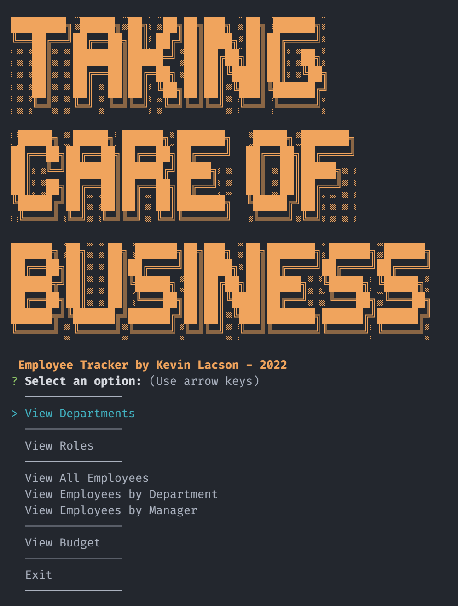

# Taking Care of Business

  
by Kevin Lacson  
Email: lacsonky@gmail.com  
GitHub: [Snackonevil](https://github.com/Snackonevil)

---

## Description

Command Line application to manage employees, roles, departments, and managers with a MySQL database.

[CODE](https://github.com/Snackonevil/taking-care-of-business) | [Walkthrough Video](https://watch.screencastify.com/v/5Uch8k0x9QWPP0lobRtL)

---

## Table of Contents

-   [Installation](#installation)
-   [Usage](#usage)
-   [Table Schemas](#table-schemas)
-   [Contribute](#contribute)
-   [License](#license)

---

## Installation

This app uses the following Node.js and the following modules:

-   [MySQL2 package](https://www.npmjs.com/package/mysql2)
-   [Inquirer package](https://www.npmjs.com/package/inquirer)
-   [console.table package](https://www.npmjs.com/package/console.table)

Create and seed database:

```
npm run initDatabase
```

Initialize App:

```
npm run start
```

---

## Usage



---

## Table Schemas

DEPARTMENTS table
| Field | Type | Key | Extras |
| ----- | ----------- | ------- | ------ |
| id | INT | Primary | Auto Increment|
| title | VARCHAR(30) | n/a | n/a |

ROLES table
| Field | Type | Key | Extras |
| ----- | ------ | ------- | ------- |
| id | INT | Primary | Auto Increment|
| title | VARCHAR(30) | n/a | n/a |
| salary | decimal(2, 2) | n/a | n/a |
| department_id | INT | Foreign | n/a | References departments.id |

EMPLOYEES table
| Field | Type | Key | Extras |
| ----- | ------ | ------- | ------- |
| id | INT | Primary | Auto Increment|
| first_name | VARCHAR(30) | n/a | n/a |
| last_name | VARCHAR(30) | n/a | n/a |
| role_id | INT | Foreign | References roles.id |
| manager_id | INT | Foreign | n/a | References employee.id |

[Schema-SQL-file](./utils/schema.sql) | [Seed-SQL-file](./utils/seed.sql)

---

## Contribute

Feel free to make a pull request

---

## License

(MIT)
Copyright 2022 Kevin Lacson

Permission is hereby granted, free of charge, to any person obtaining a copy of this software and associated documentation files (the "Software"), to deal in the Software without restriction, including without limitation the rights to use, copy, modify, merge, publish, distribute, sublicense, and/or sell copies of the Software, and to permit persons to whom the Software is furnished to do so, subject to the following conditions:

The above copyright notice and this permission notice shall be included in all copies or substantial portions of the Software.

THE SOFTWARE IS PROVIDED "AS IS", WITHOUT WARRANTY OF ANY KIND, EXPRESS OR IMPLIED, INCLUDING BUT NOT LIMITED TO THE WARRANTIES OF MERCHANTABILITY, FITNESS FOR A PARTICULAR PURPOSE AND NONINFRINGEMENT. IN NO EVENT SHALL THE AUTHORS OR COPYRIGHT HOLDERS BE LIABLE FOR ANY CLAIM, DAMAGES OR OTHER LIABILITY, WHETHER IN AN ACTION OF CONTRACT, TORT OR OTHERWISE, ARISING FROM, OUT OF OR IN CONNECTION WITH THE SOFTWARE OR THE USE OR OTHER DEALINGS IN THE SOFTWARE.
